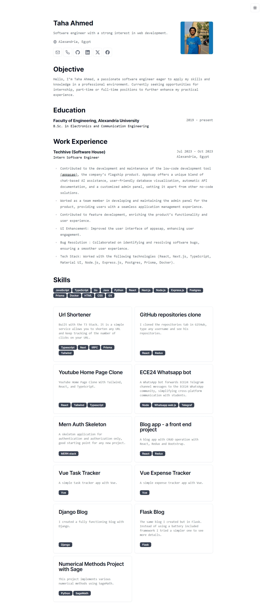

# CV



Simple web app that renders minimalist CV with print-friendly layout.

Built with Next.js and shadcn/ui, deployed on Vercel.

If you are interested seeing my actual CV, you can visit [here](https://github.com/taham8875/taham8875/blob/main/resume.pdf).

# Features

- Easy setup with [single configuration file](https://github.com/taham8875/cv/tree/main/src/data)
- Minimalist design
- Responsive layout
- Print-friendly

# Getting started

1. Clone the repository

```bash
git clone https://github.com/taham8875/cv
```

2. Navigate to the project directory

```bash
cd cv
```

3. Install dependencies

```bash
npm install
```

4. Run the development server

```bash
npm run dev
```

5. Open [http://localhost:3000](http://localhost:3000) with your browser to see the result.

# Acknowledgements

This is a clone of [BartoszJarocki/cv](https://github.com/BartoszJarocki/cv), shout out to Bartosz for this good work. I made this as a practice on Next.js and shadcn/ui.
